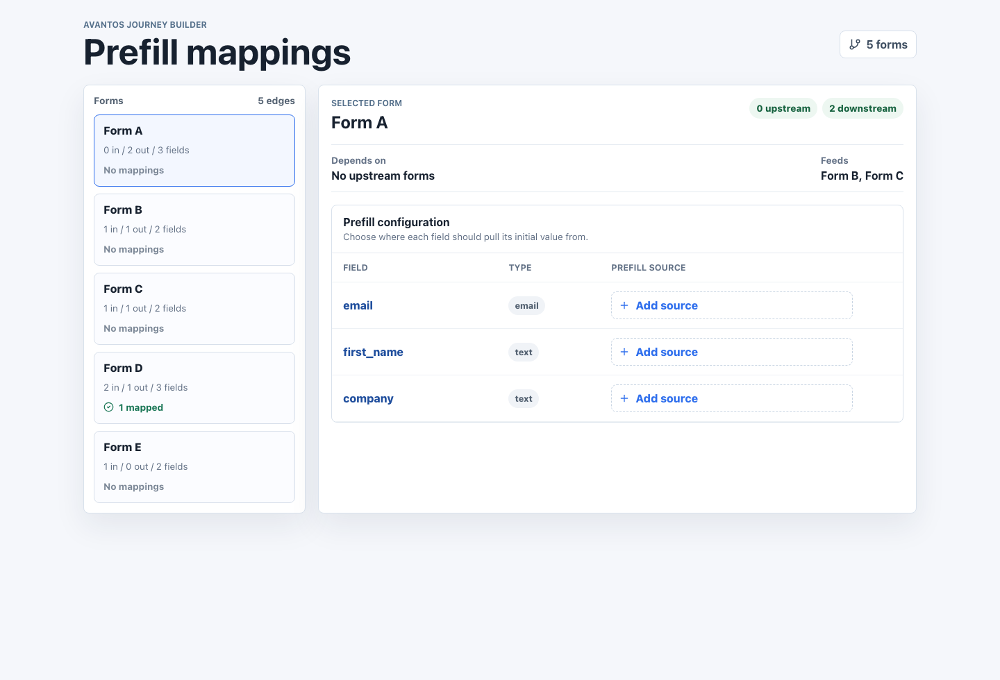

# Avantos Journey Builder

A React + TypeScript implementation of the Avantos Journey Builder coding challenge. The app loads a form DAG, lists forms, and lets users view, set, and clear prefill mappings for downstream form fields.

## Run Locally

```bash
npm install
npm run dev
```

`npm run build` is not required before local development. Run it when you want to typecheck and verify the production bundle.

By default, local fixture data loads immediately.

## Mock Server

To use the provided mock server, copy `.env.example` to `.env.local` or `.env`, then set `VITE_GRAPH_ENDPOINT` to the mock server graph URL:

```bash
VITE_GRAPH_ENDPOINT=http://<mock-server-host>/api/v1/123/actions/blueprints/bp_456/graph
```

If the request fails or the endpoint is absent, local fixture data is used.

## Scripts

```bash
npm run dev      # Start Vite
npm run lint     # Run ESLint
npm run test     # Run Vitest tests
npm run test:coverage # Run tests with 90%+ coverage thresholds
npm run build    # Typecheck and build
```

The dev server is pinned to `http://127.0.0.1:5397/` with `strictPort` enabled.

## Final Check

```bash
npm run lint
npm run test:coverage
npm run build
```

## Documentation

- [Architecture](./docs/architecture.md)
- [Challenge alignment](./docs/challenge-alignment.md)

## Screenshot



Additional screenshot assets:

- [Desktop view](./docs/assets/journey-builder-desktop.png)
- [Source picker search](./docs/assets/journey-builder-source-search.png)

## Adding A New Data Source

Add a provider that implements `DataSourceProvider`:

```ts
export const actionPropertyProvider: DataSourceProvider = {
  id: "action-properties",
  label: "Action properties",
  getSources: () => ({
    id: "action-properties",
    label: "Action properties",
    sources: [
      {
        id: "action:created-by",
        kind: "global",
        label: "action.created_by",
        description: "Action creator",
      },
    ],
  }),
};
```

Then register it in `defaultSourceProviders`. The modal and mapping table do not need to change.

## Challenge Notes

- The prompt does not require a node-based canvas, so this focuses on a polished form list and detail workflow.
- Mapping changes update in the browser only. The challenge provides a graph-read endpoint, but no save endpoint for persisting edited mappings.
- Field IDs are treated as stable mapping targets.
